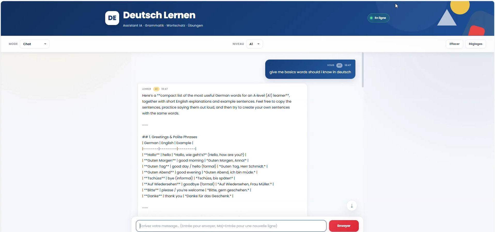
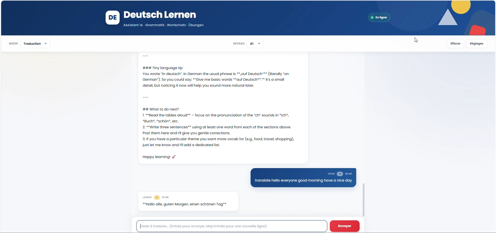

# 🇩🇪 Deutsch Lernen — AI German Learning Assistant

An AI-powered German learning platform built with **n8n**, designed to help learners practice German through conversation, vocabulary, grammar, translation, exercises, German culture, and simplified news.

The project combines **n8n workflows**, **AI agents**, **Supabase Vector Store**, external APIs, and a custom web interface to create an interactive German-learning assistant.

---

## 📋 Table of Contents

* [Overview](#-overview)
* [Project Goals](#-project-goals)
* [Website Preview](#-website-preview)
* [Demo](#-demo)
* [Architecture](#-architecture)
* [Main Components](#-main-components)
* [n8n Workflow](#-n8n-workflow)
* [AI Agent](#-ai-agent)
* [Knowledge Base](#-knowledge-base)
* [Translation](#-translation)
* [External APIs](#-external-apis)
* [Frontend](#-frontend)
* [Data Flow](#-data-flow)
* [Installation](#-installation)
* [Configuration](#-configuration)
* [AI Agent Prompt](#-ai-agent-prompt)
* [Example Requests](#-example-requests)
* [Project Structure](#-project-structure)
* [Future Improvements](#-future-improvements)

---

# 🎯 Overview

**Deutsch Lernen** is a German-learning assistant powered by AI.

The application allows a learner to interact with an AI German teacher through a web interface.

The assistant can:

* 🇩🇪 Explain German grammar
* 📚 Explain German vocabulary
* 💬 Practice German conversation
* ✍️ Correct German sentences
* 🔤 Translate text
* 📝 Generate exercises
* 🧠 Answer questions using a German knowledge base
* 🇩🇪 Explain German culture
* 📰 Provide simplified German news
* 💡 Give examples and explanations adapted to the learner's level

The backend logic is orchestrated by **n8n**.
---

# 🖥️ Website Preview

The main objectives are:

### Final Interface


###  Chat Interface



###  Translate Workflow




###  Whole Workflow


---
## 🎥 Demo

[▶️ Watch the project demo](demo/demo.mp4)

# 🎯 Project Goals

The main objectives are:

1. Create an interactive German-learning assistant.
2. Use AI to provide personalized explanations.
3. Store German educational content in a searchable vector database.
4. Allow the AI agent to retrieve relevant educational information.
5. Integrate external APIs when additional information is required.
6. Provide translation functionality.
7. Create a clean and accessible web interface.
8. Keep the system modular and easy to extend.

---

# 🏗 Architecture

The project follows this general architecture:

```text
                    ┌──────────────────────┐
                    │      Web Browser     │
                    │   Deutsch Lernen UI  │
                    └──────────┬───────────┘
                               │
                               │ HTTP Request
                               ▼
                    ┌──────────────────────┐
                    │        n8n           │
                    │    Webhook / API     │
                    └──────────┬───────────┘
                               │
                               ▼
                    ┌──────────────────────┐
                    │      AI Agent        │
                    │  German Teacher AI   │
                    └──────┬───────┬───────┘
                           │       │
              ┌────────────┘       └─────────────┐
              ▼                                  ▼
   ┌────────────────────┐             ┌────────────────────┐
   │ Supabase Vector DB │             │ External APIs       │
   │ German Knowledge   │             │ Translation / Data  │
   │ Base               │             │ Culture / News      │
   └────────────────────┘             └────────────────────┘
                           │
                           ▼
                    ┌──────────────────────┐
                    │    AI Response       │
                    └──────────┬───────────┘
                               │
                               ▼
                    ┌──────────────────────┐
                    │      Web Browser     │
                    └──────────────────────┘
```

---

# 🧩 Main Components

## 1. Web Interface

The frontend provides the user interface for interacting with the German-learning assistant.

Main functionality includes:

* Chat interface
* User input
* AI responses
* Translation interaction
* Learning-oriented UI
* Responsive design
* German-learning visual elements

The frontend communicates with n8n through an HTTP endpoint/webhook.

---

## 2. n8n

**n8n** is the central automation platform.

It manages:

* Incoming requests
* AI processing
* Tool execution
* Knowledge retrieval
* Translation
* API calls
* Response formatting
* Communication with the frontend

n8n acts as the orchestration layer between the frontend, AI model, database, and APIs.

---

# 🔄 n8n Workflow

A typical request follows this process:

```text
User
 │
 ▼
Web Interface
 │
 ▼
Webhook
 │
 ▼
Input Processing
 │
 ▼
AI Agent
 │
 ├──► Supabase Vector Store
 │
 ├──► Translation HTTP Request
 │
 ├──► External Data API
 │
 └──► Other Tools
 │
 ▼
AI Response
 │
 ▼
Respond to Webhook
 │
 ▼
Web Interface
```

---

# 🤖 AI Agent

The AI Agent is the main intelligence of the application.

Its role is to behave like a:

> Patient, encouraging and helpful German teacher.

The agent should adapt its explanations to the learner and avoid unnecessarily complicated language.

---

## AI Agent Responsibilities

The agent can:

### Grammar

Explain:

* German cases
* Articles
* Verb conjugation
* Word order
* Prepositions
* Adjectives
* Tenses
* Modal verbs
* Sentence structure

Example:

```text
Why is it "Ich gehe zur Schule"?
```

The agent explains the grammar behind the sentence.

---

### Vocabulary

The agent can explain:

* Word meanings
* Synonyms
* Antonyms
* Example sentences
* Gender/article
* Plural forms
* Common expressions

Example:

```text
What does "Umgebung" mean?
```

---

### Conversation

The agent can simulate German-learning conversations.

Example:

```text
User:
Let's practice ordering food in German.

AI:
Natürlich! Wir sind jetzt in einem Café.
Was möchtest du bestellen?
```

---

### Correction

The agent can identify mistakes and provide corrected versions.

Example:

```text
User:
Ich habe gestern nach Berlin gegangen.

AI:
Fast! The correct sentence is:

"Ich bin gestern nach Berlin gegangen."

Why?
The verb "gehen" uses "sein" in the Perfekt.
```

---

# 🧠 Knowledge Base

The project uses a **Supabase Vector Store** as the German-learning knowledge base.

The vector database contains educational information that the AI can retrieve when answering questions.

Possible content includes:

* German grammar
* Vocabulary
* Example sentences
* German culture
* Learning exercises
* Language rules
* Simplified educational articles
* German expressions

---

## Supabase Vector Store

The AI agent should use the vector store when it needs information from the project's knowledge base.

### Important parameter

The Supabase Vector Store search input is:

```text
input
```

The agent should **not** use:

```text
query
```

for this tool.

Correct:

```json
{
  "input": "German accusative case explanation"
}
```

Incorrect:

```json
{
  "query": "German accusative case explanation"
}
```

---

# 🔎 Knowledge Retrieval Process

When the user asks an educational question:

```text
User question
      │
      ▼
AI Agent
      │
      ▼
Search Supabase Vector Store
      │
      ▼
Retrieve relevant documents
      │
      ▼
AI analyzes information
      │
      ▼
Generate learner-friendly answer
```

The knowledge base helps ground the AI response in project-specific educational content.

---

# 🌍 Translation

The project includes translation functionality.

Translation can be handled through an HTTP Request tool connected to a translation API.

Typical flow:

```text
User text
   │
   ▼
AI Agent
   │
   ▼
Translation Tool
   │
   ▼
Translation API
   │
   ▼
Translated text
   │
   ▼
AI Agent
   │
   ▼
User
```

---

## Translation API

The translation component can use an HTTP API such as LibreTranslate or another compatible translation service.

Typical parameters include:

```text
q
source
target
format
```

Example conceptual request:

```text
POST /translate
```

with:

```json
{
  "q": "Guten Morgen",
  "source": "de",
  "target": "en",
  "format": "text"
}
```

> The exact endpoint and authentication depend on the translation provider configured in n8n.

---

# 🌐 External APIs

External APIs can extend the assistant beyond the internal knowledge base.

Potential integrations include:

| API / Service         | Purpose                                |
| --------------------- | -------------------------------------- |
| Supabase              | Vector knowledge base                  |
| LibreTranslate        | Translation                            |
| German news API       | Simplified news                        |
| Wikipedia / Wikimedia | German culture and general information |
| Dictionary API        | Vocabulary information                 |
| Custom HTTP APIs      | Additional learning data               |

---

# 🔧 HTTP Request Tools

n8n HTTP Request nodes can be used by the AI agent as tools.

A tool should have a clear purpose.

Examples:

```text
HTTP Request — Translate
HTTP Request — German News
HTTP Request — Culture
HTTP Request — Dictionary
```

The AI agent decides when a tool is necessary.

---

## Important Tool Configuration

When exposing an HTTP Request node as an AI tool, the tool schema must contain only the parameters expected by that tool.

For example:

```json
{
  "text": "Hallo Welt",
  "source": "de",
  "target": "en"
}
```

Avoid passing unsupported properties such as:

```text
method
url
headers
body
```

if those properties are already configured internally by the n8n HTTP Request node.

This prevents errors such as:

```text
Tool call validation failed
additionalProperties 'method', 'body', 'headers', 'url' not allowed
```

---

# 🔐 Credentials

API credentials should be configured inside n8n rather than hard-coded in the workflow or frontend.

Possible credentials include:

* AI provider API key
* Supabase credentials
* Translation API key
* News API key
* Other external API credentials

Never expose private API keys in frontend JavaScript.

---

# 💻 Frontend

The frontend is a custom HTML/CSS/JavaScript interface.

The UI is designed to provide a simple German-learning experience.

The interface can include:

```text
┌──────────────────────────────────────┐
│ 🇩🇪 Deutsch Lernen                   │
├──────────────────────────────────────┤
│                                      │
│ AI Teacher                           │
│                                      │
│  Hallo! Wie kann ich dir helfen?    │
│                                      │
│                 Ich möchte ...       │
│                                      │
├──────────────────────────────────────┤
│ Write your message...          Send │
└──────────────────────────────────────┘
```

The frontend sends requests to the n8n webhook.

---

# 🔌 Frontend → n8n

The browser sends a request to the n8n webhook.

Example:

```javascript
fetch(N8N_WEBHOOK_URL, {
  method: "POST",
  headers: {
    "Content-Type": "application/json"
  },
  body: JSON.stringify({
    message: userMessage
  })
});
```

The webhook receives the user message and starts the n8n workflow.

---

# 🔄 Data Flow

## Complete Request Lifecycle

### Step 1 — User Input

The learner enters:

```text
Explain the German accusative case.
```

### Step 2 — Frontend

The browser sends the message to the n8n webhook.

### Step 3 — Webhook

n8n receives the request.

### Step 4 — AI Agent

The AI agent analyzes the request.

### Step 5 — Knowledge Retrieval

The agent can search:

```text
Supabase Vector Store
```

for relevant grammar information.

### Step 6 — AI Processing

The model uses the retrieved information to generate an explanation.

### Step 7 — Response

The response is returned through:

```text
Respond to Webhook
```

### Step 8 — Frontend

The web interface displays the answer.

---

# 🛠 Installation

## Requirements

Before running the project, install/configure:

* n8n
* Supabase account/project
* AI model provider
* Translation API/service
* Web browser
* Node.js if required by the frontend/backend environment

---

# 1. Install n8n

You can run n8n locally or use a hosted instance.

Example local installation:

```bash
npm install n8n -g
```

Then:

```bash
n8n
```

Open the n8n interface in your browser.

---

# 2. Create the Supabase Project

Create a Supabase project.

Configure:

* PostgreSQL database
* Vector extension
* Embeddings
* Vector table
* Required indexes
* Credentials

Then connect the Supabase project to n8n.

---

# 3. Create the Knowledge Base

Prepare documents containing German-learning information.

Examples:

```text
grammar.txt
vocabulary.txt
cases.txt
verbs.txt
expressions.txt
culture.txt
```

Convert the documents into embeddings and store them in the Supabase Vector Store.

---

# 4. Configure the AI Model

Configure the AI provider used by the n8n AI Agent.

The model should support the functionality required by the workflow, such as:

* Chat completion
* Tool calling
* Structured tool parameters

---

# 5. Configure Translation

Create an HTTP Request node for the translation service.

Configure:

```text
Method: POST
URL: Translation API endpoint
Headers: API authentication if required
Body: JSON
```

Example:

```json
{
  "q": "{{text}}",
  "source": "{{source}}",
  "target": "{{target}}"
}
```

---

# 6. Configure the Webhook

Create an n8n Webhook node.

Example:

```text
POST /deutsch-lernen
```

The frontend sends requests to this endpoint.

---

# 7. Configure Respond to Webhook

The workflow should contain a:

```text
Respond to Webhook
```

node when the Webhook is configured to respond using that node.

Typical flow:

```text
Webhook
   ↓
AI Agent
   ↓
Respond to Webhook
```

If the webhook expects a response from a Respond to Webhook node, ensure that node exists in the workflow.

---

# ⚙️ Configuration

Before activating the project, verify:

### Webhook

```text
Webhook URL
HTTP Method
Response Mode
```

### AI Agent

```text
Model
System Prompt
Tools
Memory
```

### Supabase

```text
Supabase URL
Supabase credentials
Vector table
Embedding configuration
```

### Translation

```text
API endpoint
Authentication
Request body
Response field
```

---


# 🧑‍🏫 AI Agent Prompt

The core AI Agent behavior should follow principles similar to:

```text
You are a patient and encouraging German teacher.

The user is learning German.

Help the learner understand and practice German.

Rules:

- Explain German grammar clearly.
- Explain vocabulary with useful examples.
- Correct mistakes politely.
- Adapt explanations to the learner's level.
- Encourage the learner.
- Use the German knowledge base when relevant.
- When you need information from the knowledge base,
  use the Supabase Vector Store tool.
- The Supabase Vector Store tool expects the search
  text in the "input" parameter.
- Do not use "query" as a parameter for the
  Supabase Vector Store tool.
- Use translation tools when translation is required.
- Use external information tools when appropriate.
- Do not invent information when a tool can provide
  the required information.
- Keep explanations clear and educational.
```

The actual prompt can be expanded according to the project's learning objectives.

---

# 💬 Example Requests

## Grammar

```text
Explain the difference between Akkusativ and Dativ.
```

Expected behavior:

```text
Explain the concept simply,
provide examples,
and highlight the important differences.
```

---

## Vocabulary

```text
What does "zuverlässig" mean?
```

The assistant can provide:

* Meaning
* English/French equivalent
* Example sentence
* Related words

---

## Translation

```text
Translate "Ich lerne jeden Tag Deutsch" into English.
```

---

## Correction

```text
Correct this sentence:

Ich bin gestern nach Hause gegangen habe.
```

---

## Conversation

```text
Let's practice a German conversation at a restaurant.
```

---

## Culture

```text
Tell me about German Christmas traditions.
```

The assistant can retrieve relevant information from the knowledge base or use an external information source if configured.

---

# 🧪 Testing

Before deploying the project, test each component independently.

## Webhook Test

Send:

```json
{
  "message": "Hallo"
}
```

Verify that the workflow starts.

---

## AI Test

Send:

```text
Explain "sein" and "haben".
```

Verify that the AI Agent responds correctly.

---

## Vector Store Test

Search:

```text
German dative case
```

Verify that relevant documents are retrieved.

---

## Translation Test

Test:

```text
Guten Morgen
```

Verify that the translation API returns the expected result.

---

## End-to-End Test

Test:

```text
Browser
   ↓
Webhook
   ↓
AI Agent
   ↓
Tool
   ↓
Response
   ↓
Browser
```

# 📁 Project Structure

A recommended project structure:

```text
deutsch-lernen/
│
├── README.md
│
├── frontend/
│   ├── index.html
│   ├── style.css
│   └── script.js
│
├── n8n/
│   ├── workflow.json
│   └── prompts/
│       └── german-teacher.txt
│
├── knowledge-base/
│   ├── grammar/
│   ├── vocabulary/
│   ├── culture/
│   └── exercises/
│
├── docs/
│   ├── architecture.md
│   ├── api.md
│   └── setup.md
│
└── .env.example
```

---

# 🔮 Future Improvements

Possible improvements include:

## 🎓 Learning Levels

Support:

```text
A1
A2
B1
B2
C1
C2
```

The AI can adapt vocabulary and grammar explanations to the learner's level.

---

## 📝 Automatic Exercises

Generate:

* Multiple-choice exercises
* Fill-in-the-blank exercises
* Translation exercises
* Vocabulary quizzes
* Grammar exercises

---

## 📊 Progress Tracking

Store:

* Completed exercises
* Vocabulary learned
* Grammar topics
* Scores
* Learning sessions

---

## 🗣 Conversation Mode

Add dedicated conversation scenarios:

```text
Restaurant
Hotel
Airport
School
Job interview
Shopping
Doctor
Travel
```

---

## 🔊 Pronunciation

Potential future integration:

```text
Text → Speech
Speech → Text
Pronunciation feedback
```

---

## 📰 German News

Add simplified German news for learners.

The system could:

```text
News API
   ↓
Article
   ↓
AI
   ↓
Simplification
   ↓
Vocabulary explanation
   ↓
Learner
```

---

# 🔒 Security Considerations

Never expose private credentials in:

* HTML
* JavaScript
* GitHub repositories
* Public webhook responses
* Client-side environment variables

API keys should remain on the server/n8n side.

For production deployment, consider:

* Authentication
* Rate limiting
* Input validation
* HTTPS
* Secure credentials
* Webhook protection
* Logging
* Error monitoring

---

# 📈 Recommended Production Architecture

For a production version:

```text
                   Internet
                      │
                      ▼
              ┌───────────────┐
              │ Web Frontend  │
              └───────┬───────┘
                      │
                      ▼
              ┌───────────────┐
              │ Secure API /  │
              │    Webhook    │
              └───────┬───────┘
                      │
                      ▼
              ┌───────────────┐
              │      n8n      │
              └───────┬───────┘
                      │
          ┌───────────┼───────────┐
          │           │           │
          ▼           ▼           ▼
     ┌────────┐ ┌──────────┐ ┌──────────┐
     │   AI   │ │ Supabase │ │ External │
     │ Model  │ │  Vector  │ │   APIs   │
     └────────┘ └──────────┘ └──────────┘
```

---


```

# 🇩🇪 Deutsch Lernen

**An AI-powered German learning assistant built with n8n.**

The goal is simple:

> **Learn German through conversation, practice, explanations, and AI-powered assistance.**

```text
🇩🇪 Lernen
   +
🤖 AI
   +
🔎 Knowledge Base
   +
🌐 APIs
   +
⚙️ n8n
   =
📚 Deutsch Lernen
```
